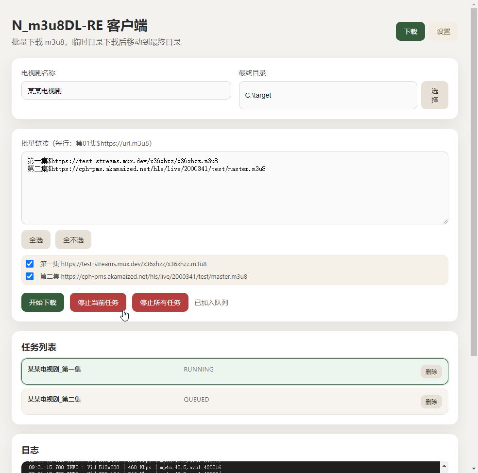

# N_m3u8DL-RE 客户端（Windows）

这是一个基于 Electron 的 N_m3u8DL-RE 图形界面客户端，用于批量下载 m3u8。支持：
- 批量输入 `第01集$https://url.m3u8` 形式的链接
- 勾选要下载的集数
- 临时目录下载完成后自动移动到最终目录
- 任务队列与日志查看

## 软件截图



## 功能特性

- 批量解析并勾选要下载的集数
- 自动创建 `临时目录\剧名` 与 `最终目录\剧名`
- 下载完成后从临时目录移动到最终目录
- 运行中任务高亮显示（RUNNING）
- 可删除队列任务或取消当前任务
- 日志显示执行命令与 N_m3u8DL-RE 输出
- 自动保存配置与批量链接内容

## 环境要求

- Windows 10/11
- Node.js 18+（建议）
- 已准备好 `N_m3u8DL-RE.exe`

默认约定：
- 程序路径：`./bin/N_m3u8DL-RE.exe`
- 临时目录：`./tmp`

## 目录结构

```
.
├─ bin\N_m3u8DL-RE.exe
├─ tmp\
├─ main.js
├─ preload.js
├─ renderer.js
├─ index.html
├─ style.css
└─ package.json
```

## 安装与运行

```bash
npm install
npm start
```

## 使用说明

1. 打开应用，进入“设置”页检查：
   - N_m3u8DL-RE 程序路径
   - 临时目录
2. 回到“下载”页，填写：
   - 电视剧名称
   - 最终目录
3. 在批量输入框中粘贴链接（每行一条）：

```
第01集$https://example.com/1.m3u8
第02集$https://example.com/2.m3u8
```

4. 在列表中勾选需要下载的集数
5. 点击“开始下载”

## 说明

- 实际下载路径为：`临时目录\剧名`
- 完成后移动至：`最终目录\剧名`
- 如果出现多码率流，应用会自动选择第一个/最佳流（`--auto-select`）

## 常见问题

### 日志乱码
已自动处理 UTF-8/GBK 解码。如果仍有乱码，请提 Issue 并附日志截图。

### 任务无法开始
请确认：
- N_m3u8DL-RE.exe 路径正确
- 临时目录与最终目录可写
- 链接格式正确（`第01集$URL`）

## 打包（Windows）

```bash
npm run dist:win
```

## 命令行版本

[N_m3u8DL-RE](https://github.com/nilaoda/N_m3u8DL-RE)

## 免责声明

请确保下载内容合法合规，作者不对任何滥用行为负责。
